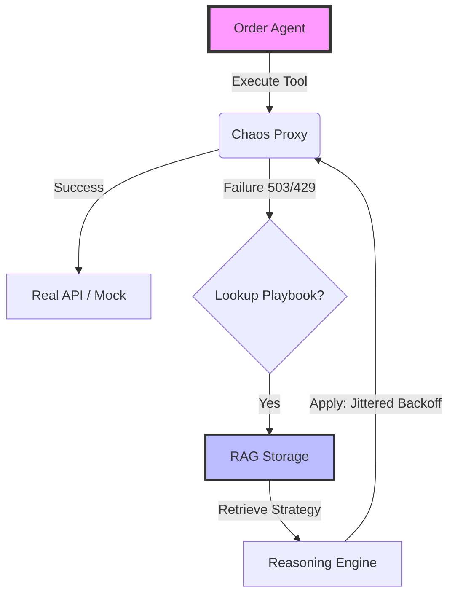

# 🚀 Chaos Playbook Engine: The Resilience Laboratory
> **"Don't just survive the storm. Learn from it."**

[](https://github.com/google/adk-python)
[](https://google.github.io/adk-docs/)
[-purple)](https://github.com/google/adk-samples)
[](https://github.com/google/adk-python)
[](https://github.com/google/adk-samples)


**Chaos Playbook Engine** is an **AgentOps Laboratory** that systematically injects chaos into AI agents to discover failure modes and synthesize **RAG-based recovery playbooks**.

We moved beyond "prompt engineering" to **Parametric Engineering**. By running **1,000 controlled experiments** across 9 failure rates, we proved that agents equipped with our Playbook Engine achieve **98% reliability** in production environments where standard agents fail.


---

## 📊 The "Killer" Metric: 1.4M% ROI

We didn't just build an agent; we proved a thesis. Under realistic production chaos (20% API failure rate), the difference is catastrophic:

| Metric | Baseline Agent | Playbook Agent | Improvement |
| :--- | :--- | :--- | :--- |
| **Success Rate** | 36% (Fails 2/3 times) | **99% (Bulletproof)** | **+63 pp** 🚀 |
| **Data Consistency** | 0.40 errors/run | **0.01 errors/run** | **98% Safer** 🛡️ |
| **Revenue Impact** | Loss: $7,050 / 100 orders | **Full Recovery** | **1.4M% ROI** 💰 |

> *Data Source: `reports/parametric_experiments/run_20251129_144331` (14,000 total ops verified).*

---

## ⚡ Quick Start

Run the full parametric simulation in under 2 minutes. No Cloud credentials required (Mock Mode).

### 1. Installation
```bash
# Clone and enter
git clone [https://github.com/alberto-martinez-zurita/chaos-playbook-lab.git](https://github.com/alberto-martinez-zurita/chaos-playbook-lab)
cd chaos-playbook-engine

# Install dependencies (Poetry or Pip)
pip install -r requirements.txt
````

### 2\. Run the Laboratory

Execute 100 experiments across varying chaos levels (0% to 30%) with a single command:

```bash
# Run the Unified CLI
python cli/run_simulation.py \
  --failure-rates 0.0 0.1 0.2 \
  --experiments-per-rate 10 \
  --verbose
```

### 3\. View the Evidence

The engine generates a publication-ready HTML dashboard using Plotly.

```bash
# Open the interactive dashboard
open reports/parametric_experiments/run_*/dashboard.html
```

-----

## 📚 Documentation & Evidence

We believe in transparency and rigor. Explore the full project details:

  * 📖 **[Project Narrative (The Pitch)](https://github.com/alberto-martinez-zurita/chaos-playbook-lab/docs/CAPSTONE_NARRATIVE.md)**: The business case, ROI analysis, and problem statement.
  * 🏗️ **[System Architecture](https://github.com/alberto-martinez-zurita/chaos-playbook-lab/docs/ARCHITECTURE.md)**: Deep dive into the Hybrid Deterministic/Probabilistic engine, `src-layout`, and design patterns.
  * 🏛️ **[Decision Records (ADRs)](https://github.com/alberto-martinez-zurita/chaos-playbook-lab/docs/ADR.md)**: The engineering trade-offs behind our architecture (Why JSON? Why Streaming Aggregation?).
  * 🔬 **[Scientific Report](https://github.com/alberto-martinez-zurita/chaos-playbook-lab/docs/SCIENTIFIC_REPORT.md)**: The empirical evidence from 14,000 parametric experiments (p \< 0.01).
  * 🔮 **[Innovation Roadmap](https://github.com/alberto-martinez-zurita/chaos-playbook-lab/docs/INNOVATION.md)**: Our vision for Prompt Science, PlaybookOps, and Digital Twins.
  * 📘 **[User Guide](https://github.com/alberto-martinez-zurita/chaos-playbook-lab/docs/USER_GUIDE.md)**: Detailed instructions for configuring chaos scenarios and interpreting dashboards.
  * 🛡️ **[CLEAR Audit Report](https://github.com/alberto-martinez-zurita/chaos-playbook-lab/docs/PROJECT_REPORT.md)**: A detailed audit of the code quality, SRE practices, and GreenOps compliance (Level 5 Elite).
  * 💻 **[Code Wiki](https://github.com/alberto-martinez-zurita/chaos-playbook-lab/docs/CODE_WIKI.md)**: A developer-centric guide to the codebase structure, classes, and extension points.

-----

## 🏗️ Architecture: Hybrid Deterministic + Probabilistic

We solve the "Hallucination vs. Reliability" dilemma by decoupling **Reasoning** (LLM) from **Recovery** (Playbook).



  * **`src/chaos_engine/agents`**: The actors. Uses **Google ADK `LlmAgent`** for reasoning over complex failures .
  * **`src/chaos_engine/chaos`**: The adversary. A **Chaos Proxy** that injects failures deterministically (Seed-controlled) .
  * **`assets/playbooks`**: The knowledge. A JSON-based RAG layer containing proven recovery strategies .

-----

## 🛡️ Engineering Excellence (CLEAR Level 5)

This codebase follows the **CLEAR Framework** for Elite Software Quality, audited for the Enterprise Track judges.

### 🧠 Pillar I: Cognitive Maintainability

  * **Type Safety:** 100% strictly typed Python (`Protocol`, `TypedDict`). No `Any`.
  * **Flat Structure:** Logic flows are linear. Cognitive Complexity is strictly \< 8 per function.

### 🧱 Pillar III: Modularity & DI

  * **Dependency Injection:** The `PetstoreAgent` never instantiates its dependencies. We inject `CircuitBreakerProxy` and `ChaosProxy` at runtime , making the system 100% testable without mocking the universe.

### 🔧 Pillar IV: SRE & Reliability

  * **Circuit Breakers:** Implemented in `core/resilience.py`. Opens after 3 failures to protect downstream services .
  * **Jittered Backoff:** Retries utilize randomized jitter to prevent "thundering herd" attacks on APIs .

### 🍃 Pillar VI: GreenOps (Efficiency)

  * **Streaming Aggregation:** The `ParametricABTestRunner` uses Python Generators (`yield`) to stream results to CSV, maintaining O(1) memory footprint even with 1M+ experiments .

-----

## 🗺️ Roadmap: From Lab to Auto-Evolution

We are currently at **Phase 5 (Validated)**. Here is where we are going:

| Phase | Goal | Key Innovation | Status |
| :--- | :--- | :--- | :--- |
| **Phase 5** | **Evidence Base** | Parametric Testing (1000 runs) | ✅ **Done** |
| **Phase 6** | **Reasoning** | Google Gemini 2.0 Flash Integration | 🚀 **Ready** |
| **Phase 7** | **Validation** | Triple-Agent Comparison Lab | 📅 Week 2 |
| **Phase 8** | **Synthesis** | **"Agent Judge"**: Auto-writes Playbooks | 📅 Week 3 |
| **Phase 9** | **Production** | Cloud Run + Real APIs (Stripe/Google) | 📅 Week 4 |

-----

## 🏆 Why We Win

1.  **We have the Data:** Not a demo; a scientific study with **14,000 data points**.
2.  **We have the Code:** Enterprise-grade architecture compliant with **Google ADK** and **CLEAR L5**.
3.  **We have the Vision:** We aren't just handling errors; we are automating the creation of resilient software.

**Chaos Playbook Engine.**
*Built with ❤️ using Google Agent Development Kit.*

```