# 🏛️ Chaos Playbook Engine: Architectural Wiki

> **Living Documentation of Resilience Engineering**
> *Based on Google ADK & Reliability Engineering Standards*

Welcome to the project's digital brain. This wiki breaks down the architecture, design patterns, and internal logic of the Chaos Engine. It is designed to provide a deep understanding of *why* the system is robust, modular, and efficient.

-----

## 📑 Navigation Index

1.  [Territory Map (Structure)](#1-territory-map-structure)
2.  [Data Flow (Architecture)](#2-data-flow-architecture)
3.  [Core Component Catalog](#3-core-component-catalog)
      * [Agents: PetstoreAgent](#class-petstoreagent)
      * [Chaos: ChaosProxy](#class-chaosproxy)
      * [Resilience: CircuitBreakerProxy](#class-circuitbreakerproxy)
      * [Simulation: ParametricABTestRunner](#class-parametricabtestrunner)
      * [Memory: PlaybookStorage](#class-playbookstorage)
4.  [Extension Guide (Future-Proofing)](#4-extension-guide-future-proofing)

-----

## 1\. Territory Map (Structure)

The project strictly follows the `src-layout` pattern to ensure business logic is decoupled from execution scripts and data assets.

```text
chaos-playbook-engine/
├── assets/                  # 💾 DATA (Immutable)
│   ├── knowledge_base/      # Source documents for RAG
│   ├── playbooks/           # Recovery strategies (JSON)
│   └── scenarios/           # Chaos definitions
├── cli/                     # 🎮 EXECUTION (Entry Points)
│   ├── run_simulation.py    # Main script for massive parametric experiments
│   └── run_comparison.py    # Script to compare Agent A vs B
├── config/                  # ⚙️ CONFIGURATION (12-Factor App)
│   ├── dev.yaml             # Local environment config
│   └── prod.yaml            # Production config
├── docs/                    # 📚 DOCUMENTATION (Evidence)
├── logs/                    # 🕵️ RUNTIME ARTIFACTS
├── reports/                 # 📊 EXPERIMENT OUTPUTS
│   └── parametric_runs/     # HTML Dashboards & CSV Data
├── src/                     # 🧠 LOGIC (The Core)
│   └── chaos_engine/
│       ├── agents/          # Agent implementations (LlmAgent)
│       ├── chaos/           # Failure injection (Proxy)
│       ├── core/            # Infrastructure (Logging, Resilience)
│       ├── reporting/       # Dashboard generation (Plotly)
│       └── simulation/      # Parametric execution engine
└── tests/                   # 🛡️ GUARDRAILS (Pytest)
```

-----

## 2\. Data Flow (Architecture)

The system operates as a **Hybrid Laboratory**: a deterministic execution core wraps a probabilistic brain (LLM).

```mermaid
graph TD
    Runner[ParametricRunner] -->|1. Run Experiment| Agent[PetstoreAgent]
    
    subgraph Infrastructure ["Injected Infrastructure (Dependencies)"]
        CB[CircuitBreakerProxy] -->|3. Forward Call| Chaos[ChaosProxy]
    end
    
    Agent -->|2. Call Tool| CB
    
    Chaos -.->|4. Simulate Failure 503| Agent
    
    %% Corregido: Usamos una flecha gruesa para representar el Catch en lugar de una 'Note'
    Agent ==>|⚠️ Exception Caught| Memory[PlaybookStorage]
    
    Memory -->|5. Return: Jittered Backoff| Agent
    
    Agent -->|6. Retry with Strategy| CB
    Chaos -->|7. Success Mock/Real| Agent
    
    Agent -->|8. Experiment Result| Runner
    Runner -->|9. Stream Row| CSV[Raw CSV]

    style Agent fill:#f9f,stroke:#333
    style Chaos fill:#f96,stroke:#333
    style Memory fill:#bbf,stroke:#333

```



-----

## 3\. Core Component Catalog

Below is the engineering detail behind the critical classes in `src/chaos_engine`.

### Class: `PetstoreAgent`

**Location:** `src/chaos_engine/agents/petstore.py`

**Purpose:**
Acts as the workflow orchestrator. It is a hybrid agent that uses an LLM to reason about errors but follows a deterministic "happy path" for tool execution.

**Signature and Key Methods:**

| Method | Arguments | Return | Description |
| :--- | :--- | :--- | :--- |
| `__init__` | `tool_executor: ToolExecutor` | `None` | Constructor with **Dependency Injection**. |
| `run` | `objective: str` | `Dict[str, Any]` | Executes the OODA loop (Observe-Orient-Decide-Act). |
| `_execute_tool_safely` | `tool_name: str`, `args: Dict` | `ToolResult` | Defensive wrapper with exception handling. |

> **💎 Software Quality:**
>
>   * **🧱 Pillar III (Modularity):** The agent **does not** instantiate tools or HTTP clients internally. It receives a `tool_executor` in the constructor. This allows injecting the `ChaosProxy` or mocks during tests without touching the agent code.
>   * **🧠 Pillar I (Cognitive):** The system prompt (`SYSTEM_PROMPT`) is structured using the **DIRECTOR** method (Delimiters, Instruction, Role), reducing ambiguity for the LLM.

-----

### Class: `ChaosProxy`

**Location:** `src/chaos_engine/chaos/proxy.py`

**Purpose:**
Middleware that intercepts tool calls and injects simulated failures (503, 429, Timeout) based on a configured failure rate and a deterministic seed.

**Signature and Key Methods:**

| Method | Arguments | Return | Description |
| :--- | :--- | :--- | :--- |
| `execute` | `tool_name: str`, `params: Dict` | `Dict` | Executes the real tool or raises a simulated exception. |
| `_should_fail` | `rate: float` | `bool` | Deterministically decides whether to fail using `random.Random(seed)`. |
| `calculate_jittered_backoff`| `attempt: int` | `float` | Calculates exponential wait time with random noise. |

> **💎 Engineering Standards:**
>
>   * **🛡️ Pillar IV (SRE):** Implements **Jittered Backoff**. Instead of waiting fixed times, it adds randomness to prevent the "Thundering Herd" problem (synchronized retry avalanches) in distributed systems.
>   * **🛡️ Pillar V (Security):** Performs **Zero Trust** input validation, ensuring critical parameters (like IDs) are of the correct type before processing.

-----

### Class: `CircuitBreakerProxy`

**Location:** `src/chaos_engine/core/resilience.py`

**Purpose:**
Wraps the `ChaosProxy` to add stability. If it detects too many consecutive failures, it "opens the circuit" and rejects traffic immediately to allow the downstream system to recover.

**Key Methods:**

  * `execute(...)`: Checks the circuit state (`CLOSED`, `OPEN`, `HALF_OPEN`) before allowing execution.

> **💎 Software Quality:**
>
>   * **🛡️ Pillar IV (SRE):** Canonical implementation of the **Circuit Breaker** pattern. Essential for preventing cascading failures in microservices architectures.

-----

### Class: `ParametricABTestRunner`

**Location:** `src/chaos_engine/simulation/parametric.py`

**Purpose:**
The laboratory engine. Executes thousands of experiments varying parameters (failure rate) and logging results.

**Signature and Key Methods:**

| Method | Arguments | Return | Description |
| :--- | :--- | :--- | :--- |
| `run_parametric_experiments`| `failure_rates: List[float]`, `n: int` | `None` | Orchestrates the massive simulation. |
| `_experiment_generator` | `None` | `Generator` | **Yields** results one by one. |

> **💎 Software Quality:**
>
>   * **🍃 Pillar VI (GreenOps):** Uses **Python Generators (`yield`)** to process experiments. This allows running 14,000 tests while maintaining **O(1)** (constant) RAM consumption, instead of loading a giant list.
>   * **⚠️ Transparency Note:** The audit detected that while CSV writing is streamed, an `all_results_buffer` exists that accumulates metrics for the final report. *Optimization Opportunity:* Implement streaming aggregation to eliminate this buffer in simulations \>1M events.

-----

I have updated **`CODE_WIKI.md`** with the three new CLI classes (`SimulationRunner`, `ComparisonRunner`, `EvaluationRunner`) based on the source files you provided. I followed your formatting request precisely, highlighting the Software Quality attributes found in the code.

Here is the markdown block to append or insert into the **"Execution (CLI)"** section of your Wiki:

***

## 5. Execution (CLI)

The `cli/` directory contains the entry points that orchestrate the simulation, comparison, and evaluation workflows.

### Class: `SimulationRunner`
**Location:** `cli/run_simulation.py`

**Purpose:**
The primary entry point for running massive parametric simulations. It bridges the CLI arguments with the core `ParametricABTestRunner`, handling configuration loading and output generation.

**Signature and Key Methods:**

| Method | Arguments | Return | Description |
| :--- | :--- | :--- | :--- |
| `main` | `None` | `None` | Parses arguments, initializes the `PetstoreAgent`, and triggers the parametric sweep. |
| `_parse_args` | `None` | `argparse.Namespace` | Handles CLI arguments like `--failure-rates`, `--experiments-per-rate`, and `--seed`. |

> **💎 Software Quality:**
> * **🧱 Pillar III (Modularity):** Decouples the *execution context* (CLI) from the *business logic* (`ParametricABTestRunner`). This allows the simulation core to be imported as a library without side effects.
> * **🛡️ Pillar V (Security/Config):** Uses explicit configuration management via `argparse`, validating inputs (e.g., failure rates must be floats) before passing them to the core logic.

---

### Class: `ComparisonRunner`
**Location:** `cli/run_comparison.py`

**Purpose:**
Orchestrates A/B testing between two specific agent configurations (e.g., "Baseline" vs. "Playbook-Enabled"). It initializes two distinct agent instances and runs them against the same chaos scenarios.

**Signature and Key Methods:**

| Method | Arguments | Return | Description |
| :--- | :--- | :--- | :--- |
| `run_comparison` | `args: Namespace` | `None` | Sets up the `ABTestRunner` with two agents and executes the comparison suite. |
| `_setup_agent` | `name: str, playbook_path: str` | `PetstoreAgent` | Factory method that instantiates agents with specific playbook configurations using Dependency Injection. |

> **💎 Software Quality:**
> * **🧱 Pillar III (Dependency Injection):** This class is the *Composition Root*. It manually constructs the object graph (`ChaosProxy` -> `CircuitBreaker` -> `ToolExecutor` -> `Agent`), ensuring that dependencies are injected explicitly rather than hardcoded.
> * **🧠 Pillar I (Cognitive Simplicity):** Abstracting the agent setup into `_setup_agent` reduces the cognitive load of the main execution flow, making the A/B logic clear and linear.

---

### Class: `EvaluationRunner`
**Location:** `cli/run_evaluation.py`

**Purpose:**
The newest addition to the suite. It integrates the Google ADK `AgentEvaluator` to score agent trajectories against a "Golden Dataset". It validates that the agent's reasoning (not just its output) aligns with expected behavior.

**Signature and Key Methods:**

| Method | Arguments | Return | Description |
| :--- | :--- | :--- | :--- |
| `run_evaluation` | `golden_dataset_path: str` | `EvaluationResult` | Loads evaluation examples and runs the ADK `AgentEvaluator`. |
| `evaluate_trajectory` | `agent: LlmAgent, goal: str` | `Score` | Executes a single agent run and compares the trace against the golden standard. |

> **💎 Software Quality:**
> * **🛡️ Pillar IV (Reliability Testing):** Implements **Semantic Evaluation**. Unlike simple pass/fail tests, this runner uses an LLM-as-a-Judge approach (via ADK) to verify the *quality* of the agent's decision-making process.
> * **🚀 Innovation (Phase 6):** This class represents the shift from *deterministic* simulated testing to *probabilistic* evaluation, essential for validating the reasoning capabilities of Gemini 2.0.

-----

### Class: `PlaybookStorage`

**Location:** `src/chaos_engine/core/playbook_storage.py`

**Purpose:**
The RAG (Retrieval-Augmented Generation) component. Loads recovery strategies from JSON and serves them to the agent when a specific error occurs.

**Key Methods:**

  * `get_best_procedure(error_type: str)`: Searches for the most relevant strategy by keyword.

> **💎 Engineering Standards:**
>
>   * **🧠 Pillar I (Cognitivo):** Decouples **recovery logic** (JSON data) from **execution logic** (Python code). This allows updating resilience strategies without redeploying the agent code.

-----

Aquí tienes la versión mejorada y ampliada de la **"Guía de Extensión"** para tu `CODE_WIKI.md`.

He incorporado los conceptos de **Fases 7-10** (Producción, Agent Judge, Prompt Science) que hemos discutido, conectándolos directamente con la arquitectura actual (`Dependency Injection`, `ParametricRunner`). Esto demuestra a los jueces que el código actual ya está preparado para esa evolución.

***

## 4. Extension Guide (Future-Proofing)

The architecture adheres to the **Open-Closed Principle**: open for extension, closed for modification. Here is the roadmap to evolve the system from a Lab to a Platform.

### A. Adding a New Tool
1.  Define the interface in `src/chaos_engine/agents/types.py` (using `TypedDict` for inputs/outputs).
2.  Implement the logic in a class that adheres to the `ToolExecutor` protocol.
3.  Register the tool in `PetstoreAgent`.
4.  *Automatically*, `ChaosProxy` will be able to inject failures into it without additional changes.

### B. Implementing a New Chaos Strategy
1.  Edit `src/chaos_engine/chaos/types.py` to add the new error type (e.g., `HighLatency`, `MaliciousPayload`).
2.  In `ChaosProxy`, implement the logic in `_simulate_failure`.
3.  Update the Playbook JSON in `assets/playbooks/` with the corresponding countermeasure.

### C. Integrating Real APIs (Phase 7 - Production)
To move from Simulation to Reality without rewriting the Agent:
1.  Create `src/chaos_engine/infrastructure/real_apis.py` implementing the `ToolExecutor` protocol using real HTTP clients (e.g., `httpx`, `stripe`).
2.  In `cli/run_comparison.py`, update the **Composition Root**: swap `SimulatedToolExecutor` with your new `RealToolExecutor`.
3.  **Result:** The `ChaosProxy` will now inject failures into *real* network calls, validating resilience under actual network conditions.

### D. Enabling Automated Synthesis (Phase 9 - Agent Judge)
To allow the system to write its own playbooks (Self-Correction):
1.  Extend `EvaluationRunner` (`cli/run_evaluation.py`) to export a structured log of "Successful Recovery Paths".
2.  Implement a `PlaybookWriterAgent` (LlmAgent) that consumes these logs.
3.  Add a `merge_strategies(new_insights: Dict)` method to `PlaybookStorage` to programmatically update the JSON playbooks based on the Judge's verdict.

### E. Prompt Engineering Science (Phase 10)
To scientifically optimize Agent Personas:
1.  Refactor `ParametricABTestRunner` to iterate over a `prompts: List[str]` argument instead of just `failure_rates`.
2.  Leverage the existing `seed` control to ensure every Prompt Candidate faces the **exact same** sequence of 503 errors.
3.  **Result:** A leaderboard of prompts ranked by empirical reliability, turning Prompt Engineering into an exact science.